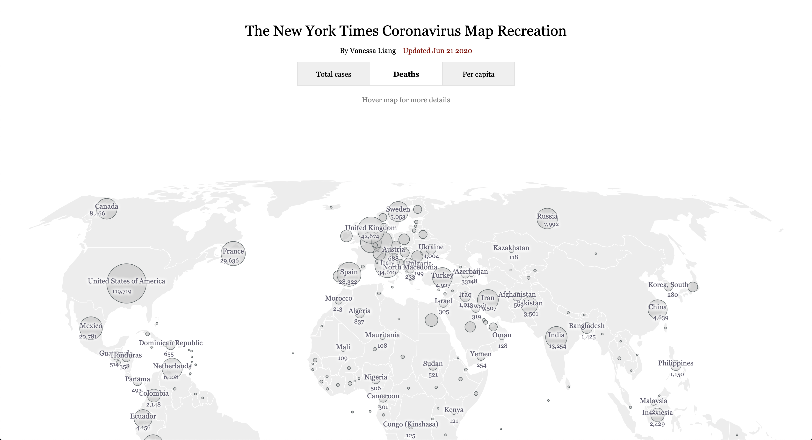

# The New York Times Coronavirus Map Recreation with React

The map can be found [here](https://vanessaaleung.github.io/corona-map-react/)

## Data
The data is realtime fetched from [Johns Hopkins University](https://github.com/CSSEGISandData/COVID-19)

## In-development
***This project hasn't been updated since March 2020.***

1. Resize the circle as cases number has increased dramatically since March.
2. Add tooltips for circles
